# 🌿 Katalog TOGA — Tanaman Obat Keluarga

Aplikasi Android Katalog & Pencarian Data berbasis tanaman obat tradisional Indonesia, dibuat sebagai tugas Ujian Akhir Semester (UAS) mata kuliah Pemrograman Seluler.

---

## 👤 Identitas Mahasiswa

| |                                      |
|---|--------------------------------------|
| **Nama Lengkap** | Ni Luh Risma Putri Wirdianthi        |
| **NIM** | 42430001                             |
| **Mata Kuliah** | Pemrograman Seluler                  |
| **Topik Aplikasi** | Katalog Tanaman Obat Keluarga (TOGA) |

---

## 📱 Tentang Aplikasi

**TOGA** (Tanaman Obat Keluarga) adalah aplikasi referensi digital yang memuat katalog **15 tanaman obat tradisional Indonesia**. Pengguna dapat mencari tanaman berdasarkan nama atau kategori, mengurutkan daftar secara alfabetis, serta melihat detail lengkap setiap tanaman — mulai dari manfaat kesehatan, cara penggunaan, hingga peringatan konsumsi.

### Daftar Tanaman dalam Katalog

| No | Nama | Nama Latin | Kategori |
|----|------|------------|----------|
| 1 | Jahe | *Zingiber officinale* | Rimpang |
| 2 | Kunyit | *Curcuma longa* | Rimpang |
| 3 | Kencur | *Kaempferia galanga* | Rimpang |
| 4 | Lidah Buaya | *Aloe vera* | Sukulen |
| 5 | Serai | *Cymbopogon citratus* | Herbal |
| 6 | Kumis Kucing | *Orthosiphon aristatus* | Herbal |
| 7 | Temulawak | *Curcuma xanthorrhiza* | Rimpang |
| 8 | Kayu Manis | *Cinnamomum verum* | Kulit Kayu |
| 9 | Daun Sirih | *Piper betle* | Daun |
| 10 | Kapulaga | *Elettaria cardamomum* | Rempah |
| 11 | Biji Pala | *Myristica fragrans* | Rempah |
| 12 | Sambiloto | *Andrographis paniculata* | Herbal |
| 13 | Seledri | *Apium graveolens* | Sayuran |
| 14 | Kelor | *Moringa oleifera* | Daun |
| 15 | Belimbing Wuluh | *Averrhoa bilimbi* | Buah |

---

## ✅ Fitur & Implementasi Modul

### Modul 2 & 3 — Desain UI Responsif
- Tampilan grid 2 kolom menggunakan `RecyclerView` + `GridLayoutManager`
- Desain menggunakan `CardView` dan tema Material Design berwarna hijau
- Layout menyesuaikan orientasi: tersedia `layout/` (portrait) dan `layout-land/` (landscape)
- Penanganan `WindowInsets` untuk mendukung layar notch dan sistem navigasi modern

### Modul 4 & 5 — Navigasi Intent & Validasi Input
- Navigasi antar halaman: `SplashActivity` → `MainActivity` → `DetailActivity`
- Data tanaman dikirim antar activity menggunakan `Intent.putExtra()`
- Validasi `if-else` pada kolom pencarian:
    - Jika input **kosong** → tampilkan semua data
    - Jika input **ada hasil** → tampilkan hasil filter
    - Jika input **tidak ditemukan** → tampilkan pesan *"Tanaman tidak ditemukan"*

### Modul 6 — Array & Pencarian Data
- Data katalog disimpan dalam struktur `MutableList` pada objek singleton `DataTanaman`
- Fitur pencarian menggunakan `.filter()` bawaan Kotlin — menyaring elemen berdasarkan kondisi
- Pencarian berlaku untuk **nama tanaman** dan **kategori** secara *case-insensitive*
- Hasil pencarian diperbarui secara real-time saat pengguna mengetik (`addTextChangedListener`)

### Modul 7 — Pengurutan Data (Bubble Sort)
- Tombol **A → Z**: mengurutkan daftar secara *ascending* menggunakan algoritma Bubble Sort
- Tombol **Z → A**: mengurutkan daftar secara *descending* menggunakan algoritma Bubble Sort
- Sorting bekerja pada data yang sedang ditampilkan (terintegrasi dengan hasil pencarian)
- Tombol aktif diberi highlight warna berbeda sebagai feedback visual

### Modul 9 — Error Handling & Logcat
- Seluruh blok kritis dibungkus dengan `try-catch` untuk mencegah crash
- Aktivitas aplikasi direkam menggunakan `Log.d / Log.i / Log.e` di semua Activity
- **Tag Logcat menggunakan NIM:** `TAG = "42430001"`
- Log mencakup: inisialisasi Activity, klik item, proses pencarian, proses sorting, perpindahan halaman

---

## 📸 Screenshot Aplikasi

### Tampilan Portrait

|                   Splash Screen                    |                  Halaman Utama                   |                   Halaman Detail                   |
|:--------------------------------------------------:|:------------------------------------------------:|:--------------------------------------------------:|
| 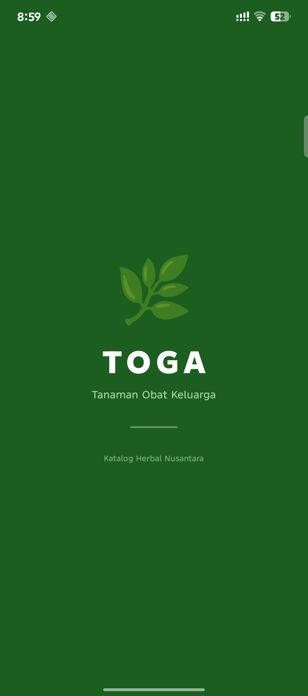 | 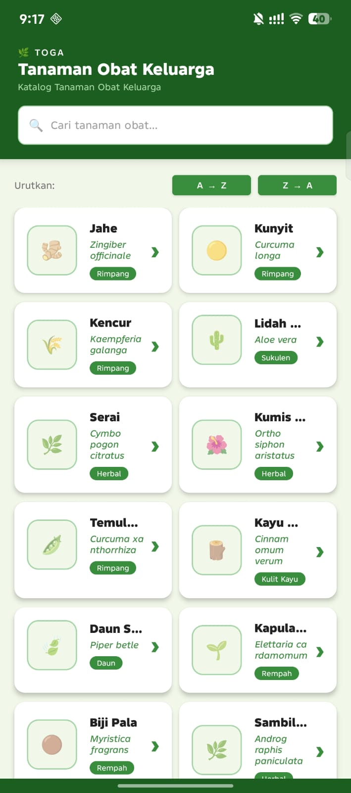 | 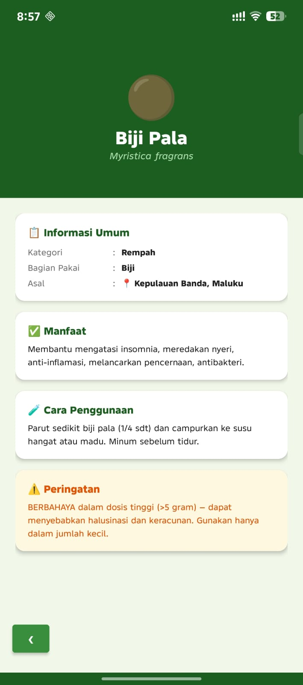 |

### Tampilan Landscape

|                    Splash Screen (Landscape)                    |             Halaman Utama (Landscape)             |             Halaman Detail (Landscape)              |
|:---------------------------------------------------------------:|:-------------------------------------------------:|:---------------------------------------------------:|
| 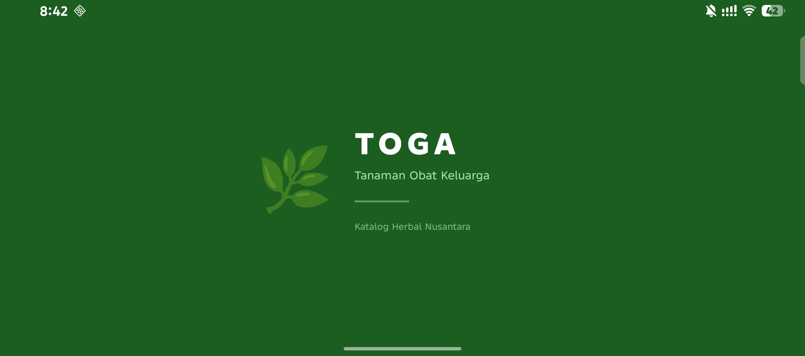 | 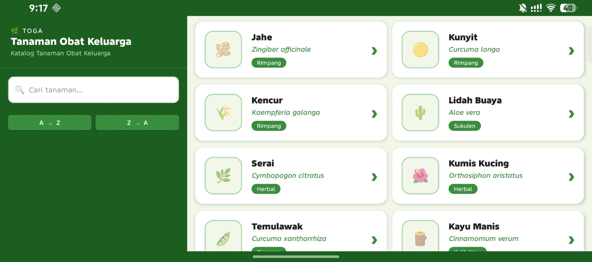 | 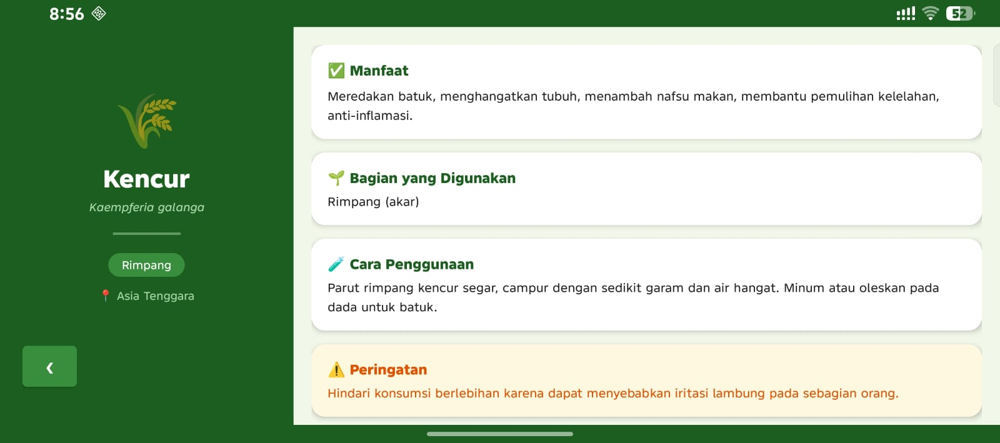 |

---

## 🔍 Screenshot Pencarian & Pengurutan Portrait

|                   Pencarian Data                   |                Hasil Tidak Ditemukan                |
|:--------------------------------------------------:|:---------------------------------------------------:|
| 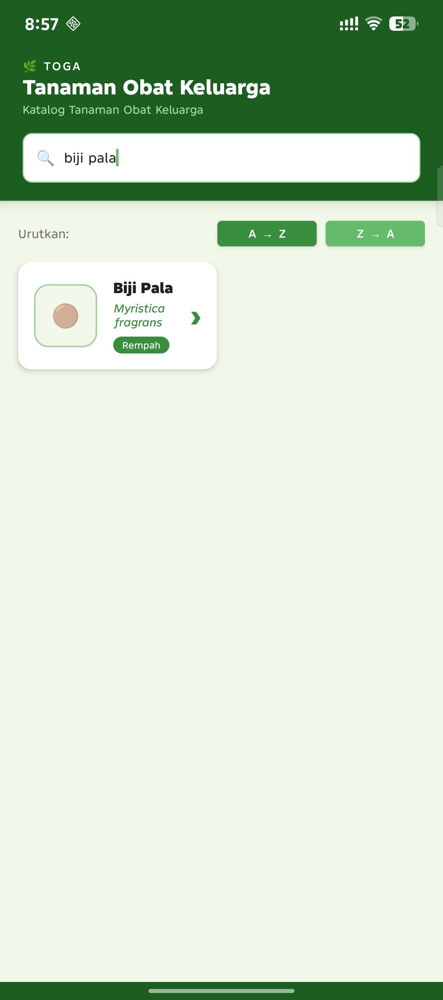 | 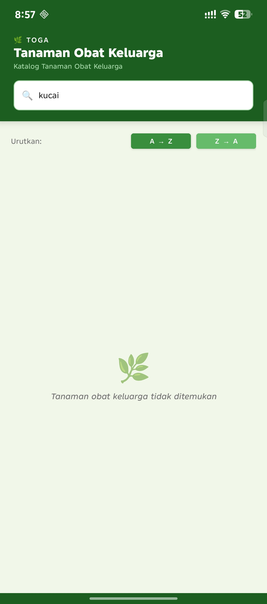 |

|                      Urutan A → Z                      |                      Urutan Z → A                      |
|:------------------------------------------------------:|:------------------------------------------------------:|
| 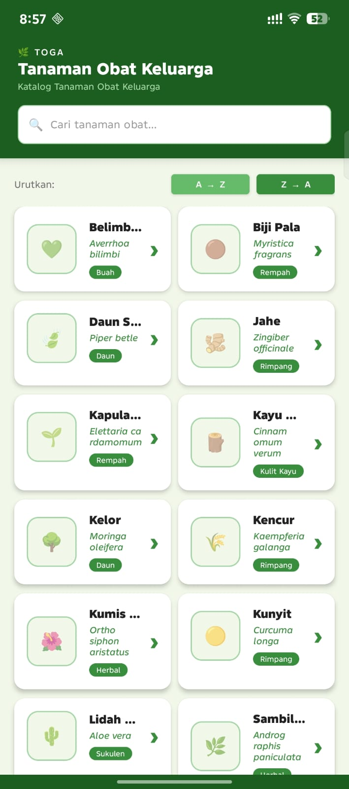 | 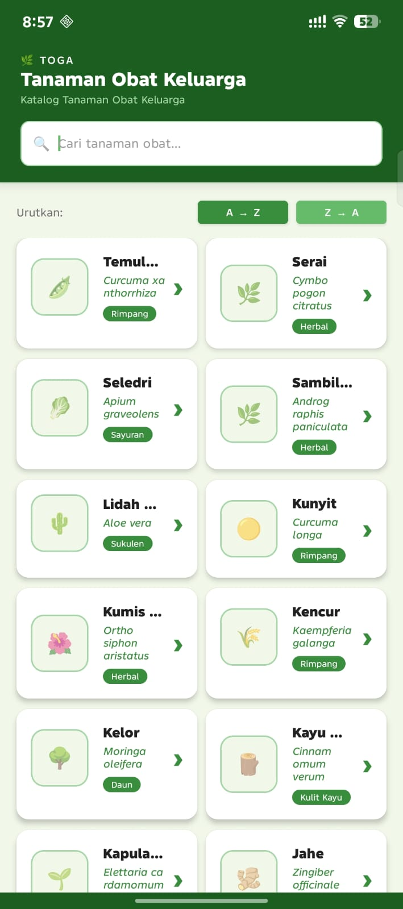 |

---

## 🔍 Screenshot Pencarian & Pengurutan Landscape

|                   Pencarian Data                    |                Hasil Tidak Ditemukan                 |
|:---------------------------------------------------:|:----------------------------------------------------:|
| 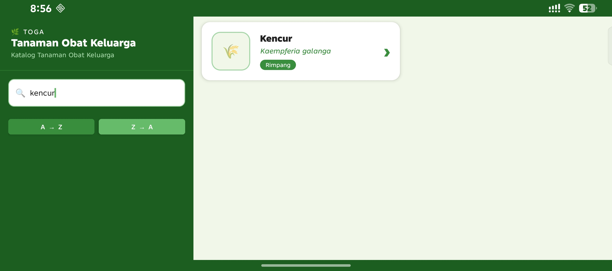 | 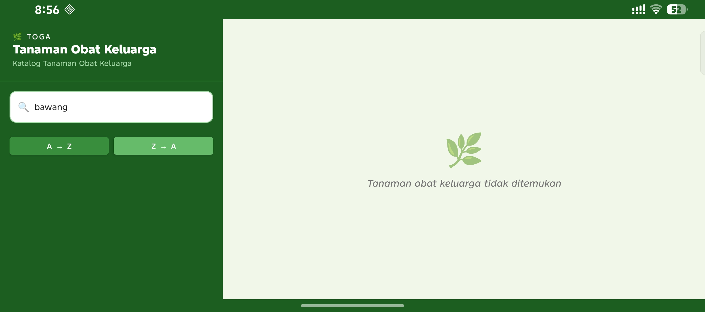 |

|                      Urutan A → Z                       |                      Urutan Z → A                       |
|:-------------------------------------------------------:|:-------------------------------------------------------:|
| 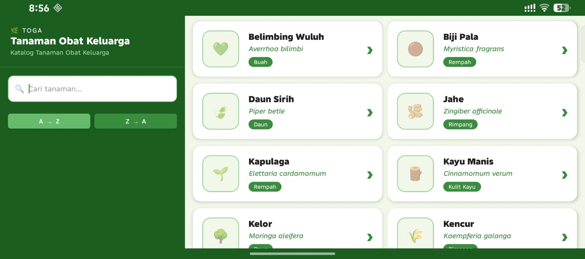 | 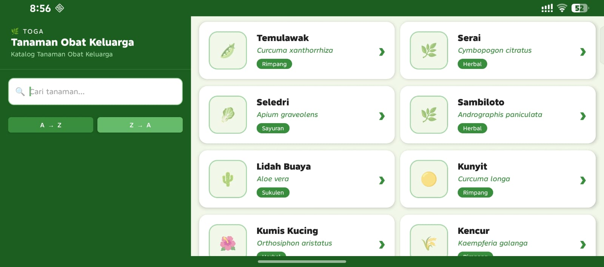 |

---

## 📋 Screenshot Logcat

> Logcat direkam di Android Studio menggunakan filter Tag: `42430001`

|        Logcat — Aktivitas Aplikasi        |                     Logcat — Aktivitas Aplikasi                     |
|:-----------------------------------------:|:-------------------------------------------------------------------:|
| 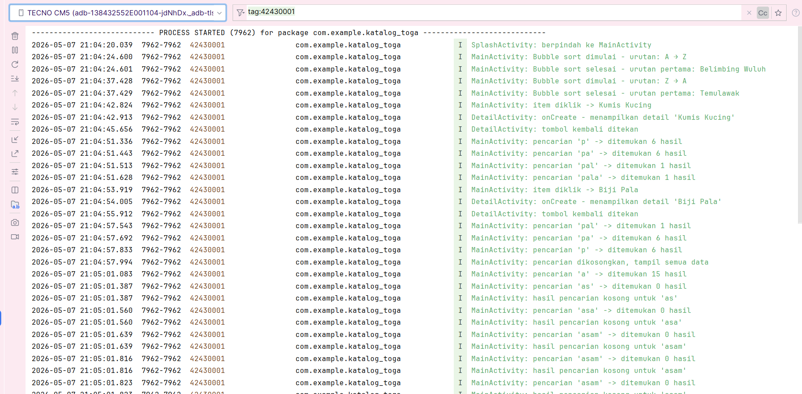 | 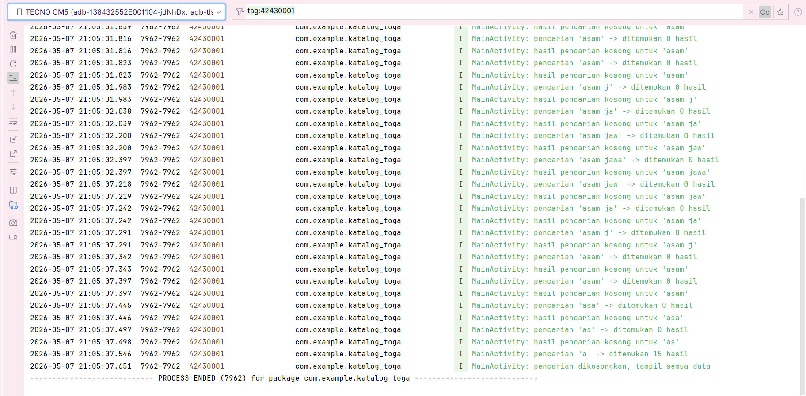 |

---